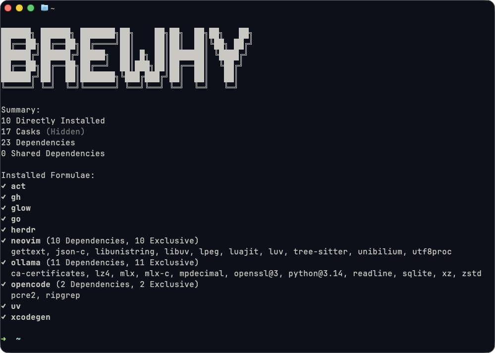

# Brewhy

A read-only CLI that explains why each formula is installed.

## Preview



## Why?

To understand which Homebrew packages you installed yourself and which ones are there because other packages need them.

## Installation

Run this command in your terminal and open a new terminal after installation.

```bash
curl -fsSL https://raw.githubusercontent.com/ivemadestuff/brewhy/master/scripts/install.sh | bash
```

Requires `macOS with Homebrew` and `Node.js 22.14+ (22.x) or 24.10+` with `npm`.

### Update

Run the [installation command](#installation) again to update to the latest release.

### Uninstall

```bash
curl -fsSL https://raw.githubusercontent.com/ivemadestuff/brewhy/master/scripts/install.sh | bash -s -- --uninstall
```

This removes Brewhy's installed files and command link; Homebrew packages and shell configuration are preserved.

## Usage

Run `brewhy` for an overview or `brewhy --help` for all available options.

## Guides

- [Development](docs/guides/Development.md)
- [Troubleshooting](docs/guides/Troubleshooting.md)
